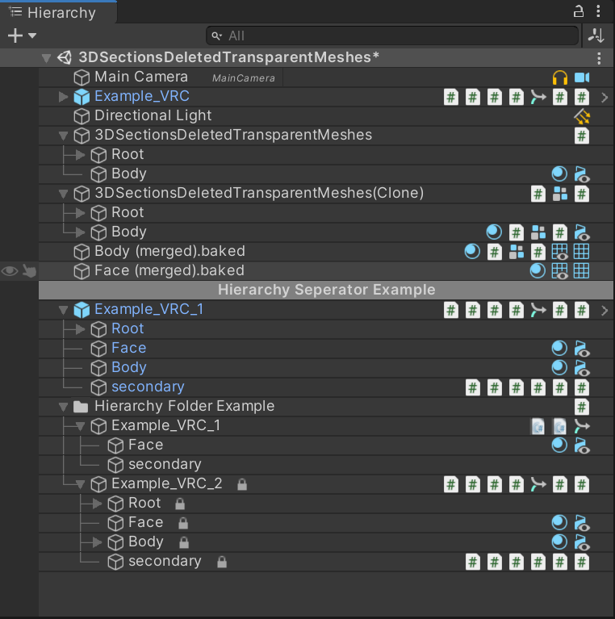
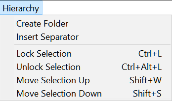

# Hierarchy2 for Unity

### Make your hierarchy more useful

### Menu

### New paid version out

I create a paid [Hierarchy 4](https://assetstore.unity.com/packages/slug/242660) package (Now available on asset store), paid package allows me to spend more time on it, add new features, fix bugs, optimize, update soon when something changes, and make sure it work stably with Unity.
